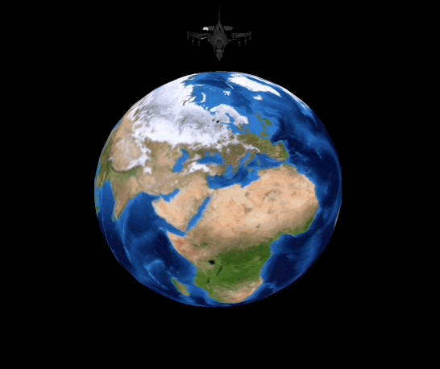

# Homework 2 - Travel the world
A 3D graphics program demonstrating various visual effects using OpenGL. The program features an earth model with a rotating airplane in orbit.

## Basic Controls
- **A/D Keys**: Rotate the airplane's orbit axis
- **S Key**: Toggle earth squeeze effect
- **R Key**: Toggle airplane rainbow color mode
- **H Key**: Toggle helicopter mode
- **ESC**: Exit program

## Visual Effects

### Airplane 
#### Normal
 

Default view showing the earth and orbiting airplane.

#### Rotate Axis 
 

Use `A`/`D` keys to adjust the airplane's orbit orientation.

#### Helicopter Mode
 

Press `H` to activate/deactivate helicopter transformation.

### Earth
#### Squeeze 


Press `S` to toggle/un-toggle earth squeeze effect.

#### Rainbow 


Press `R` to toggle/un-toggle airplane rainbow color effect.


## Technical Details
- [Vertex shaders](src/shader/vertex.glsl) and [Fragment shaders](src/shader/fragment.glsl) for rendering
- Texture mapping for earth and airplane
- Matrix transformations for object positioning and rotation
- Custom effects including squeeze and rainbow color transitions using vertex and fragment shaders

## Build Instructions

1. Ensure you have the following dependencies:
   - OpenGL
   - GLFW
   - GLM
   - CMake

2. Build the project:
    ```bash
    mkdir build
    cd build
    cmake ..
    make
    ```

3. Run the executable:
    ```bash
    ./ICG_2024_HW2
    ```